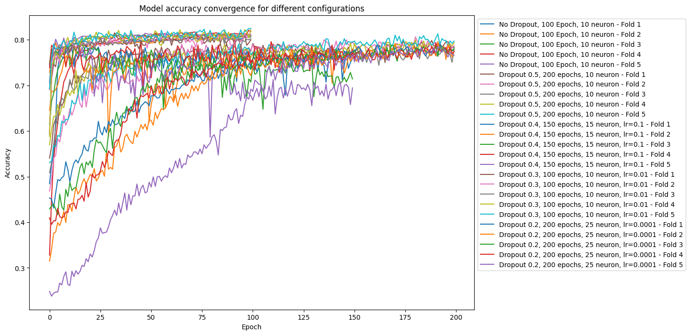
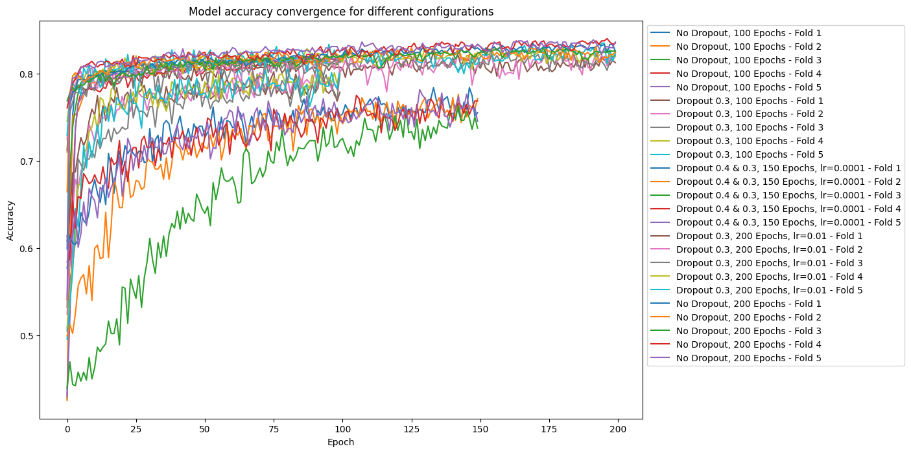

# Implementation of Different Architectures for Multilayer Perceptron

In this repository, there are three files:

## mammographic_work3
The dataset used is the Mammographic Mass Dataset, acquired from the UCI Machine Learning Repository. Additionally, this file includes explanatory introductions about the functioning and structure of the dataset.

## Metrics of MLP1
The first architecture has only one hidden layer and allows for various adjustable configurations, including parameters such as dropout, learning rate, and the number of neurons. Furthermore, the code is flexible, permitting the inclusion and modification of additional layers as necessary.

## Metrics of MLP2
The second architecture has two hidden layers and allows for various adjustable configurations, including parameters such as dropout, learning rate, and the number of neurons. Furthermore, the code is flexible, permitting the inclusion and modification of additional layers as necessary.

## Model Performance

### Architecture 1 Performance

| Configuration                          | Accuracy | Precision | Recall | F1-Score | Specificity |
|----------------------------------------|----------|-----------|--------|----------|-------------|
| No Dropout, 100 epochs, 10 neurons     | 0.8023   | 0.7568    | 0.8384 | 0.7948   | 0.7702      |
| Dropout 0.5, 200 epochs, 10 neurons    | 0.7960   | 0.7535    | 0.8270 | 0.7872   | 0.7684      |
| Dropout 0.4, 150 epochs, 15 neurons, lr=0.1  | 0.7887   | 0.7616    | 0.7838 | 0.7712   | 0.7874      |
| Dropout 0.3, 100 epochs, 10 neurons, lr=0.01 | 0.7960   | 0.7623    | 0.8103 | 0.7846   | 0.7834      |
| Dropout 0.2, 200 epochs, 25 neurons, lr=0.0001| 0.7804   | 0.7475    | 0.7915 | 0.7668   | 0.7111      |

#### Convergence Plot

### Architecture 2 Performance

| Configuration                          | Accuracy | Precision | Recall | F1-Score | Specificity |
|----------------------------------------|----------|-----------|--------|----------|-------------|
| No Dropout, 100 epochs                 | 0.7960   | 0.7610    | 0.8143 | 0.7856   | 0.7801      |
| Dropout 0.3, 100 epochs                | 0.7991   | 0.7653    | 0.8101 | 0.7860   | 0.7873      |
| Dropout 0.4 and 0.3, 150 epochs, lr=0.0001 | 0.7877   | 0.7429    | 0.8251 | 0.7807   | 0.7551      |
| Dropout 0.3, 200 epochs, lr=0.01       | 0.7991   | 0.7633    | 0.8199 | 0.7890   | 0.7821      |
| No Dropout, 200 epochs                 | 0.7888   | 0.7563    | 0.8018 | 0.7769   | 0.7780      |

#### Convergence Plot

## Libraries Used

- **Pandas:** Data manipulation and analysis.
- **Numpy:** Numerical computing.
- **Scikit-learn:** Machine learning tools for data analysis and model training.
- **TensorFlow:** Deep learning framework for building and training neural networks.
